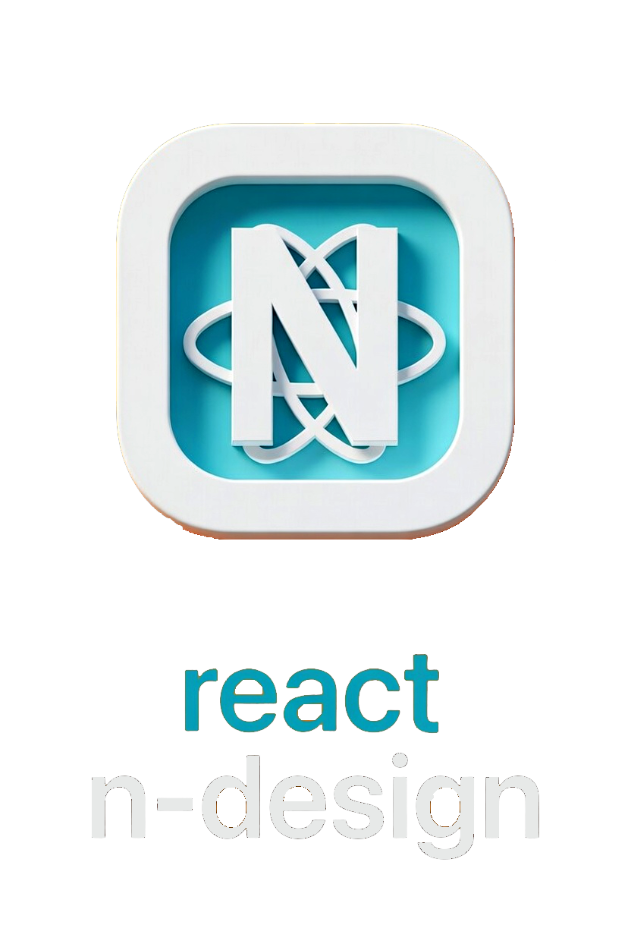

<div align="center">
  <br />
  
  <br />
</div>

<p align="center">
  A stunning, lightweight, and modern React component library built with TypeScript and styled-components, based on <strong>Neomorphic</strong> design principles.
</p>

<p align="center">
  <a href="https://www.npmjs.com/package/react-n-design">
    
  </a>
  <a href="https://SoumyoNawab8.github.io/react-n-design/">
    
  </a>
</p>

<p align="center">
  <a href="https://www.npmjs.com/package/react-n-design">
    
  </a>
  <a href="https://github.com/SoumyoNawab8/react-n-design/actions/workflows/main.yml">
    
  </a>
  <a href="https://bundlephobia.com/package/react-n-design">
    
  </a>
  <a href="https://github.com/SoumyoNawab8/react-n-design/blob/master/LICENSE">
    
  </a>
  <a href="#components">
    
  </a>
</p>

## Installation

Install the package along with its required peer dependencies:

```bash
npm install react-n-design
# or
yarn add react-n-design
```

**Peer dependencies required:**

| Package | Version |
| --- | --- |
| `react` | >=18.0.0 |
| `react-dom` | >=18.0.0 |

## Quick Start

### Option A — Built-in theme context (recommended)

The `ThemeContextProvider` handles theme state and injects the theme into styled-components automatically. Use `useThemeContext` to read or toggle the active theme.

```tsx
import React from 'react';
import {
  ThemeContextProvider,
  useThemeContext,
  Button,
  Switch,
} from 'react-n-design';

function ThemeToggle() {
  const { theme, toggleTheme } = useThemeContext();

  return (
    <Switch
      checked={theme === 'dark'}
      onChange={() => toggleTheme()}
      label={theme === 'dark' ? 'Dark Mode' : 'Light Mode'}
    />
  );
}

function App() {
  return (
    <ThemeContextProvider>
      <ThemeToggle />
      <Button variant="primary">Hello World</Button>
    </ThemeContextProvider>
  );
}

export default App;
```

### Option B — Manual styled-components ThemeProvider

If you already have a `ThemeProvider` in your app, pass one of the built-in themes directly:

```tsx
import React from 'react';
import { ThemeProvider } from 'styled-components';
import { lightTheme, Button } from 'react-n-design';

function App() {
  return (
    <ThemeProvider theme={lightTheme}>
      <Button variant="primary">Click me</Button>
    </ThemeProvider>
  );
}

export default App;
```

## Theming

The library ships with `lightTheme` and `darkTheme` out of the box. Both are typed against the `Theme` type so your editor will autocomplete all tokens.

```tsx
import { lightTheme, darkTheme, Theme } from 'react-n-design';

// Create a custom theme
const customTheme: Theme = {
  name: 'custom',
  borderRadius: '8px',
  colors: {
    primary: '#0070f3',
    background: '#fafafa',
    white: '#ffffff',
    text: '#333333',
    shadowDark: '#d0d0d0',
    shadowLight: '#ffffff',
    hoverBg: '#e8e8e8',
    skeletonBg: '#e0e0e0',
    knobBg: '#f5f5f5',
    cardBg: '#f0f0f0',
  },
  shadows: {
    soft: '7px 7px 14px #d0d0d0, -7px -7px 14px #ffffff',
    softInset: 'inset 7px 7px 14px #d0d0d0, inset -7px -7px 14px #ffffff',
  },
};
```

## React Server Components

`react-n-design` provides a dual entry point for compatibility with React Server Components (RSC):

- **Client components** (default entry): `import { Button, Modal } from 'react-n-design'`
  - Includes interactive and animated components that require a client environment.
- **Server-safe exports** (RSC entry): `import { Button, Card } from 'react-n-design/rsc'`
  - Includes only components that can safely render in a server context (no `'use client'` directive).

Use the `/rsc` entry when you need to import components inside Server Components without adding a `"use client"` boundary.

```tsx
// In a Server Component (e.g., Next.js App Router)
import { Card, Stack, Typography } from 'react-n-design/rsc';

export default function Page() {
  return (
    <Card>
      <Stack direction="column" gap="16px">
        <Typography.Title level={1}>Server-rendered content</Typography.Title>
        <Typography.Text>Hello from the server!</Typography.Text>
      </Stack>
    </Card>
  );
}
```

## Components

### General

| Component | Description |
| --- | --- |
| **Button** | Customizable button with multiple variants and states |
| **Card** | Neomorphic container for grouping content |
| **Icon** | Wrapper for react-icons with consistent sizing and color |
| **Tag** | Small label for keywords or categories |
| **Badge** | Status indicators and count badges |
| **Avatar** | User avatar with image fallback and grouping |
| **Skeleton** | Placeholder preview while content loads |
| **VisuallyHidden** | Hides content visually but keeps it accessible to screen readers |
| **SkipToContent** | Accessibility link to skip to main content |
| **Toast** | Notification system with positions and promise support |
| **Divider** | Horizontal or vertical separator line |

### Layout

| Component | Description |
| --- | --- |
| **Stack** | Flexbox-based vertical/horizontal layout with gap support |
| **Grid** | CSS Grid layout wrapper with responsive props |
| **Drawer** | Slide-over panel with focus trap and scroll lock |
| **Modal** | Dialog window that appears over the main content |
| **Tooltip** | Small pop-up label with multiple triggers and positions |

### Navigation

| Component | Description |
| --- | --- |
| **Tabs** | Organizes content into switchable views |
| **Accordion** | Vertically stacked, collapsible panels |
| **Breadcrumbs** | Navigation path with ARIA support |
| **Menu** | Dropdown menu with keyboard navigation |
| **Carousel** | Touch-friendly image/content slider |
| **Stepper** | Multi-step wizard with navigation |
| **Tree** | Hierarchical tree view with expand/collapse |

### Forms

| Component | Description |
| --- | --- |
| **Input** | Advanced input with icons, addons, and validation states |
| **Select** | Feature-rich dropdown for single and multiple selections |
| **Switch** | Animated toggle for boolean states |
| **Slider** | Range input with keyboard and touch support |
| **ComboBox** | Autocomplete with filtering, multi-select, and async loading |
| **DatePicker** | Single/range date selection with keyboard navigation |
| **ColorPicker** | Color selection with preset swatches and custom input |
| **FileUpload** | Drag-and-drop file upload with progress and validation |
| **MultiSelect** | Multiple selection dropdown with chips and search |
| **Form** | Form state management with validation |

### Data Display

| Component | Description |
| --- | --- |
| **Table** | Data table with sorting and pagination |
| **DataGrid** | Virtualized table with sorting, filtering, and pagination |
| **Alert** | Contextual feedback messages |
| **ProgressBar** | Visual indicator for task completion |
| **Typography** | Text primitives: **Text**, **Title**, and **Paragraph** |

### Examples

```tsx
import { Button, Input, Card, Alert } from 'react-n-design';

// Button
<Button variant="primary" size="medium">Primary Button</Button>

// Input
<Input label="Email" placeholder="Enter your email" inputSize="medium" allowClear />

// Card
<Card variant="default" padding="20px">
  <h3>Card Title</h3>
  <p>Card content goes here...</p>
</Card>

// Alert
<Alert
  type="success"
  message="Success!"
  description="Your action was completed successfully."
  showIcon
  closable
/>
```

## Tree Shaking

`sideEffects: false` is set in `package.json`, so modern bundlers (webpack, Vite, Rollup) will automatically remove any components you do not import.

```tsx
// Only Button and Input end up in your bundle
import { Button, Input } from 'react-n-design';
```

## Testing

The library is tested with **Jest** and **React Testing Library**.

```bash
# Run the test suite
npm test

# Run in watch mode
npm run test:watch
```

## CLI

A small CLI is included to scaffold new components into your project:

```bash
# Add a component to your project (copies source to your local codebase)
npx react-n-design add <ComponentName>

# Example
npx react-n-design add Button
```

## Development

```bash
# Clone the repository
git clone https://github.com/SoumyoNawab8/react-n-design.git

# Install dependencies
npm install --legacy-peer-deps

# Start Storybook for development
npm run dev

# Build the library
npm run build

# Build Storybook for static deployment
npm run build-storybook
```

## Issues & Feature Requests

Found a bug or have a feature request? Please open an issue on our [GitHub repository](https://github.com/SoumyoNawab8/react-n-design/issues).

## Contributing

Contributions are welcome!

1. Fork the project
2. Create your feature branch (`git checkout -b feature/AmazingFeature`)
3. Commit your changes (`git commit -m 'Add some AmazingFeature'`)
4. Push to the branch (`git push origin feature/AmazingFeature`)
5. Open a Pull Request

## License

MIT &copy; [SoumyoNawab8](https://github.com/SoumyoNawab8)
